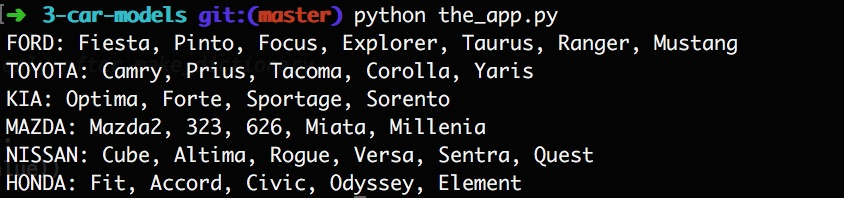

# Python Car Models Exercise

**Author**: Megan Ford July 2016 


Created as a student exercise as part of Nashville Software School's Back End Bootcamp curriculum. Please see below for fulfilled requirements: this exercise is not meant to be a finished production app or indication of current skills, but rather a demonstration of skills learned and utilized at the time of creation.


## Instructions


NSS Back-End Milestone 2 (Command Line Interface) Exercise 3: 


[Requirements For Project](https://github.com/nashville-software-school/python-milestones/blob/master/02-command-line-applications/exercises/CLI_CAR_MODELS.md)


## Install


``` 
git clone https://github.com/MeganCFord/NSS-PY2-car-models.git
cd 3-car-models
python __.py
```




## License 


[MIT license](LICENSE.md)

